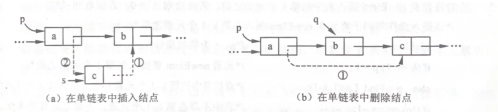
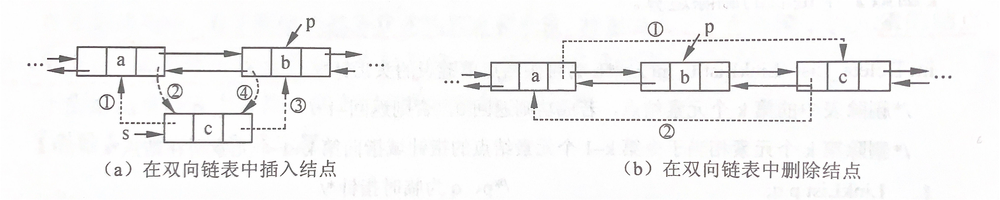

## 数据结构（Golang）

### 单链表

单链表是用通过指针链接起来的结点来存储数据元素的线性结构。只需要一个指针（头指针）指向第一个结点，就可以顺序地访问到表中的任意一个元素。在单链表中进行插入和删除，其实质都是对相关指针的修改。

- 单链表的查找
- 单链表的插入
- 单链表的删除

### 双链表

- 双链表的查找
- 双链表的插入
- 双链表的删除

### 栈

1、栈的定义

栈是只能通过访问它的一端来实现数据存储和检索的一种线性数据结构。栈的修改是按先进后出的原则进行的。因此，栈又称为后进先出（Last In First Out，LIFO）的线性表。在栈中进行插入和删除操作的一端称为栈顶，另一端称为栈底。不含数据元素的栈称为空栈。

2、栈的基本运算

- 初始化栈
- 判断栈空
- 入栈
- 出栈
- 读栈顶元素

3、栈的存储结构

- 顺序存储

- 链式存储

4、栈的应用

栈的典型应用包括表达式求值、括号匹配等，在计算机语言的实现以及将递归过程转变为非递归过程的处理中，栈有重要的作用。

### 队列

1、队列的定义

队列是一种先进先出（First In First Out，FIFO）的线性表，它只允许在表的一端插入元素，而在表的另一端删除元素。在队列中，允许插入元素的一端称为队尾（Rear），允许删除元素的一端称为队头（Front）。

2、队列的基本运算

- 初始化队列
- 判断队列空
- 入队
- 出队
- 读队头元素

3、队列的存储结构

- 顺序存储
- 链式存储

4、队列的应用

队列结构常用于处理需要排队的场合，例如操作系统中处理打印任务的打印队列、离散事件的计算机模拟等。

### 树

### 图

### 查找

### 排序

## 算法（Golang）

- [x] [位运算](bitwise.go)
    - 加减法 [☯](binary_operate.go)
    - 不用额外的变量交换两个变量 [☯](bitwise.go#L22)
    - 数组中仅有一个数是奇数个，其余数都是偶数个，找出奇数个的那个数 [☯](bitwise.go#L38)
    - 保留 int 型二进制数中最右侧的 1 [☯](bitwise.go#L51)
    - 数组中有两个数是奇数个，其余数都是偶数个，找出这两个数 [☯](bitwise.go#L69)
    - 二进制数中 1 的数量 [☯](bitwise.go#L109)

- [x] [链表](linked_list.go)
    - 单向链表 [☯](linked_list.go#L12)
        - 反转链表（迭代）
        - 把给定值都删除
    - 双向链表 [☯](linked_list.go#L77)
        - 实现头插、尾插、头出、尾出的双端链表
        - 反转双链表

- [x] [栈 & 队列](stack_queue.go)
    - 用双向链表实现栈 [☯](stack_queue.go#L17)
    - 用数组实现栈 [☯](stack_queue.go#L45)
    - 用双向链表实现队列 [☯](stack_queue.go#L80)
    - 用数组实现队列 [☯](stack_queue.go#L108)
    - 用两个栈实现队列 [☯](stack_queue.go#L175)
    - 用两个队列实现栈 [☯](stack_queue.go#L240)

- [x] 【树】
    - [前缀树](trie.go)

- [ ] [图]()

- [ ] [查找]()
    - 顺序查找
    - 折半查找

- [x] 【排序】
    - 比较排序
        - [选择排序](sort/select_sort.go)
        - [冒泡排序](sort/bubble_sort.go)
        - [插入排序](sort/insert_sort.go)
        - [归并排序](sort/merge_sort.go)
        - [快速排序](sort/quick_sort.go)
        - [堆排序](sort/heap_sort.go)（[堆结构](sort/heap_structure.go)）
    - 桶排序（不基于比较的排序）
        - [计数排序](sort/counting_sort.go)
        - [基数排序](sort/radix_sort.go)
    - 排序算法总结

  |          | 时间复杂度 | 空间复杂度 | 稳定性 | 选用条件   |
            | -------- | ---------- | ---------- | ------ | ---------- |
  | 选择排序 | O(N^2)     | O(1)       | 不稳定 |            |
  | 冒泡排序 | O(N^2)     | O(1)       | 稳定   |            |
  | 插入排序 | O(N^2)     | O(1)       | 稳定   |            |
  | 归并排序 | O(N*log N) | O(N)       | 稳定   | 为了稳定性 |
  | 快速排序 | O(N*log N) | O(log N)   | 不稳定 | 为了速度   |
  | 堆排序   | O(N*log N) | O(1)       | 不稳定 | 为了空间   |
  | 计数排序 | O(N)       | O(M)       | 稳定   |            |
  | 基数排序 | O(N)       | O(N)       | 稳定   |            |

- [x] [递归](recursion.go)
    - 阶乘
    - 反转单链表

- [x] 分治
    - [归并排序](merge_sort.go) ★★★★☆
        - [计算数组的小和](small_sum.go)
        - [数组中的逆序对](reverse_pair.go)
        - 哪些场景可以利用归并排序的红利：
          两个组合并时，较小的那个数写入有序组前，可以立即算出另外一组中大于当前值的元素数量（end-cur+1）。
          即计算某个数的左组或右组中比它大的元素数量时，可以利用归并排序。

- [ ] [动态规划]()

- [ ] [贪心]()

- [ ] [回溯]()

- [ ] [分支限界法]()

